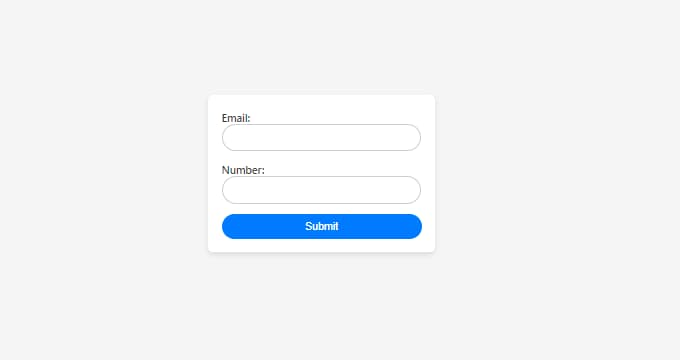
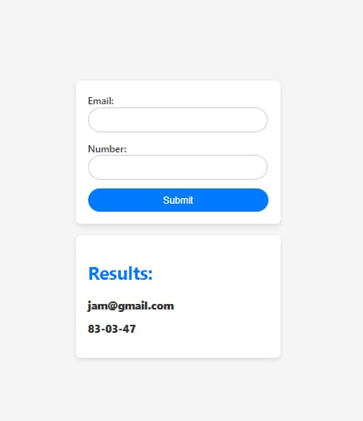
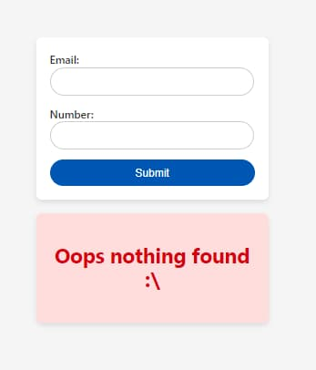

# Email Search App

This application allows you to search for contacts by email. If the email is found in the database, it will display the contact information. Otherwise, it will show a message indicating that nothing was found.

 ## How to Use
1. Enter an email address in the search field.
2. Click the "Submit" button to search for the contact.

## Example Email Addresses
- jim@gmail.com
- jam@gmail.com
- john@gmail.com
- jams@gmail.com
- jill@gmail.com

## Screenshots

**Found Contact**

**No Contact Found**

## Technologies Used
- React
- Formik
- Yup
- Axios
- Styled-components

## How to Run
1. Clone this repository.
2. Install dependencies with npm install.
3. Start the application with npm start.

## Additional Notes
- The application performs a search for contacts based on the entered email address.
- If a contact is found, it will display the contact's email and formatted phone number.
- If no contact is found, it will display a message indicating that no contact was found.

## Author
For any inquiries or assistance, please contact us at [ovsyannikovnikolai1790@gmail.com](ovsyannikovnikolai1790@gmail.com).

Thank you for choosing our  E-Pharmacy Management System!